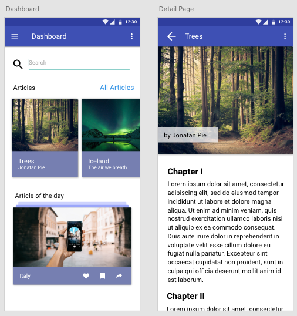

# Chingu Solo Project - Flutter - Tier 2 - News API

## Overview

This project helps you gain experience in using API's to enhance the value
your applications provide to their users. Your objective with this project is 
to build a mobile application with Flutter using the News API to receive latest news and show them to your users.

## Instructions

General instructions for all Solo Projects are located in the 
[Chingu Library](https://voyage.docs.chingu.io/prework/howwork). For detailed 
requirements, please checkout the following.

### For Beginners in Dart and Flutter

The primary programming language in Flutter is Dart. Dart is a programming language from Google primarily focused on performance and UI design, so it is perfect for Flutter development. If you have never worked with Dart, I would recommend to start with the [first Tier](https://github.com/md-weber/soloproject-tier1-flutter-projectname) of the Flutter projects. But if you feel ready here are some ressources that can help you.

- [How to install Dart](https://dart.dev/get-dart)

- [Dart Language Tour](https://dart.dev/guides/language/language-tour)

- [Excersim - Learn Dart the practical way](https://exercism.io/tracks/dart)

### Requirements

#### Structure

- [ ] Read over the Currents API documentation
  Topics to look for in the [News API](https://newsapi.org/) documentation:
  
  - API endpoint
  - Receive a Developer API Key
  - How to query only for the exact info you need.
  - Search for Keywords

- Create the screens on the screenshot and show the articles in the cards.
  
  - Use a Futurebuilder to receive the information
  - Find a way to reload the articles
  
#### Style

- [ ] You may use any style you choose. However, it should be consistent (e.g.
  font, font size, color scheme, layout, etc.).
  
  - See [8 Rules of mobile design](https://uxdesign.cc/8-rules-of-mobile-design-1b8d9936c241)
  
- [ ] Use the correct widget depending on the system
  - Cupertino Widgets - iOS Apple
  - Material Widgets - Android

#### Features

- [ ] Show multiple articles
  - [ ] If you tap on an article you should get directed to a detail page
  - [ ] Highlight one article as the article of the day
- [ ] Textfield should be able to query for a news article
- [ ] Show for each article an image

#### Other

- [ ] Your repo needs to have a robust `README.md` (See [Keys to a Well-Written Readme](https://medium.com/chingu/keys-to-a-well-written-readme-55c53d34fe6d))

- [ ] Before submitting make sure that there are no errors in the developer console

- [ ] Anticipate and handle any edge cases
  
  - [ ] Does entering random data, such as a mix of alphbetic, numeric, and
    special characters in the search input result in an error?
  - [ ] What is displayed if the search location is not found?

- [ ] The app should be responsive across multiple devices (e.g. phone, tablet, 
  laptop, and desktop computers)
  
#### Extras (Not Required)

- [ ] Use as FEW external packages and libraries as possible to reduce the 
  number of dependencies.

- [ ] Write Unit and Widget Tests

- [ ] Use Accessibility techniques (i.e. a11ly) to improve your site for users 
  with impairments 

- [ ] Add a `CONTRIBUTING.md` file with instructions on how to contribute to
  your project

- [ ] Create a Web Application and / or Desktop Application
  
  - [Flutter Web Support](https://flutter.dev/web)
  - [Flutter Desktop Support](https://flutter.dev/desktop) 
